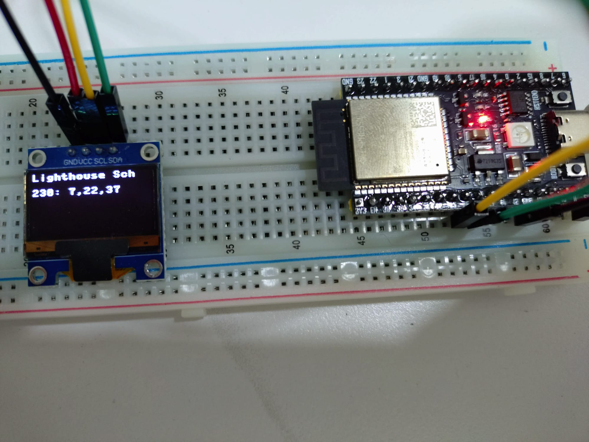
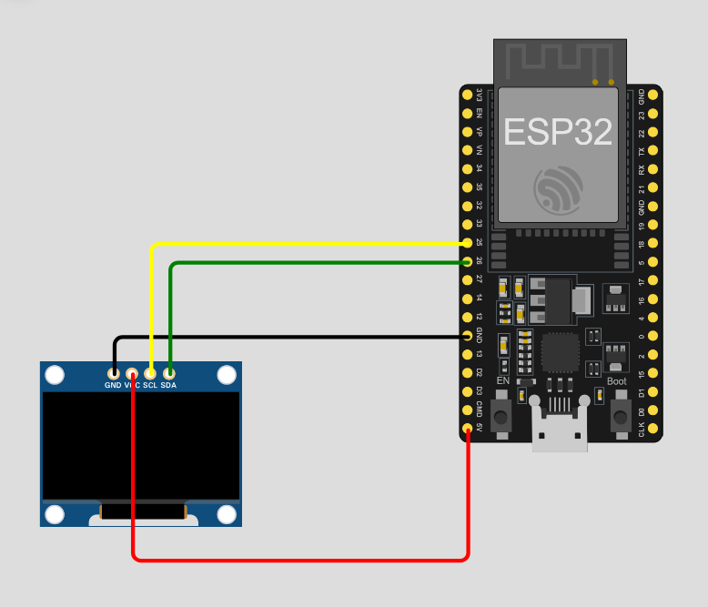

# ESP32 Singapore Bus Arrival Tracker

This project uses an ESP32 microcontroller to fetch real-time bus arrival data from the Singapore LTA (Land Transport Authority) DataMall API and displays the timings on an SSD1306 OLED screen. 

Currently, the project is configured to display the next three arrival timings for **Bus 230** at **Lighthouse Sch (Bus Stop: 52211)**.

<!-- INSERT PICTURE HERE: A working shot of the ESP32 and OLED display showing the bus timings -->


## 💡 Why This Project?

Morning commutes are often rushed. Unlocking a phone, navigating to a transit app, and waiting for UI elements to load just to check a single bus timing adds unnecessary friction when trying to get out the door. Often, my phone stays in my pocket entirely while I'm getting ready.

I built this dedicated hardware tracker to solve a simple "glanceability" problem:
* **Zero-Friction Access:** Placed right by the entrance door—*"within sight, within mind."*
* **Fast Boot-to-Display:** Boots, syncs time, fetches live LTA data, and renders timings in under 10 seconds from power-on.
* **Hands-Free Routine:** Lets me glance at incoming arrivals while putting on shoes or grabbing my keys, without touching a screen.

Instead of navigating an app, it turns live arrival data into ambient information at the exact physical moment and place it's needed most.

## 🛠 Hardware Requirements
To replicate this project, you will need:
*   **ESP32 Development Board:** ESP32-WROOM-32E (or similar).
*   **OLED Display:** 0.96" SSD1306 OLED Display (128x64 resolution, I2C interface).
*   **Cables:** Micro-USB (or USB-C depending on your board) for programming and power.
*   **Wiring:** 4x Female-to-Female jumper wires (if connecting directly) or a breadboard with jumper wires.

## 🔌 Wiring Guide
Connect the SSD1306 OLED display to the ESP32 using the following I2C pin configuration:

| SSD1306 OLED Pin | ESP32 Pin | Description |
| :--- | :--- | :--- |
| **VCC** | 5V / VIN | Power supply |
| **GND** | GND | Ground |
| **SCL** | GPIO 25 | I2C Clock |
| **SDA** | GPIO 26 | I2C Data |

<!-- INSERT PICTURE HERE: A clear close-up photo or diagram showing the wire connections between the ESP32 and the OLED pins -->


## 💻 Software & Prerequisites
Before running the code, ensure you have the following software and credentials ready:

1.  **Thonny IDE:** Download and install [Thonny](https://thonny.org/), a beginner-friendly IDE for MicroPython.
2.  **MicroPython Firmware:** The ESP32 must be flashed with the latest MicroPython firmware.
3.  **LTA DataMall API Key:** You must register for a free account at [LTA DataMall](https://datamall.lta.gov.sg/) to generate an `AccountKey`.
4.  **2.4GHz Wi-Fi:** The ESP32 only connects to 2.4GHz Wi-Fi networks (5GHz is not supported).

## 📦 Required Libraries
The SSD1306 driver is not built into MicroPython by default, so you need to load it onto your board:

1. Download the official driver file directly from the [MicroPython Library Repository](https://raw.githubusercontent.com/micropython/micropython-lib/master/micropython/drivers/display/ssd1306/ssd1306.py).
2. Open the file in Thonny with your ESP32 plugged in.
3. Go to **File** → **Save As...**, choose **MicroPython device**, and name the file exactly `ssd1306.py`.

## 🚀 Setup & Installation
1.  **Clone or Copy the Code:** Open a new file in Thonny and paste the provided `main.py` code.
2.  **Configure Credentials:** Locate the following variables in the code and update them with your own details:
    ```python
    WIFI_SSID = "YOUR_WIFI_NAME"
    WIFI_PASS = "YOUR_WIFI_PASSWORD"
    ```
3.  **Add API Key:** Update the headers dictionary with your LTA DataMall Account Key:
    ```python
    headers = {
        "AccountKey": "YOUR_LTA_DATAMALL_KEY", 
        "accept": "application/json"
    }
    ```
4.  **Run the Code:** Save the script to your ESP32 as `main.py` so it runs automatically on boot, or hit the "Run" button in Thonny to test it. 

## ⚙️ How It Works
1.  **Network Setup:** The ESP32 connects to the specified Wi-Fi network.
2.  **Time Synchronization:** It uses `ntptime` to sync the internal clock with Google's NTP servers (adjusting +8 hours for Singapore Standard Time).
3.  **API Request:** A GET request is sent to the LTA DataMall API for the specific bus stop and service number. Garbage collection (`gc.collect()`) is triggered right before the request to prevent memory allocation crashes.
4.  **Data Parsing:** The JSON response is parsed to extract the estimated arrival times of the next 3 buses. The ISO time strings are converted to epochs and subtracted from the current SGT time to get the wait time in minutes.
5.  **Display:** The OLED is cleared and updated with the bus stop name and the upcoming timings (e.g., `230: Ar, 5, 12` where "Ar" stands for Arriving).

## ⚠️ Limitations & Future Improvements
*   **Memory/Hardware Constraints:** Due to the limited RAM on the ESP32 when handling large JSON responses, the current code is constrained to fetching and displaying data for a single bus service at a single bus stop. Attempting to parse the entire bus stop's data at once may result in a `MemoryError`.
*   **Screen Space:** The 128x64 display is optimized for this specific layout. Adding more bus services would require scrolling text or paging logic.
*   **Strict 3-Bus Requirement:** The current code hardcodes the expectation of exactly three incoming buses. If the API returns fewer than three scheduled buses (for example, late at night when service is ending), the script will throw an `IndexError` and stop running.
